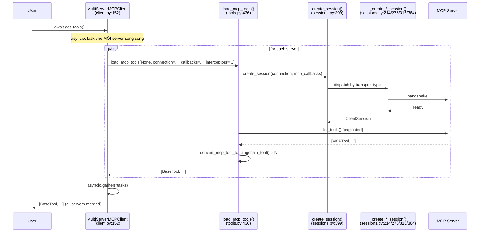
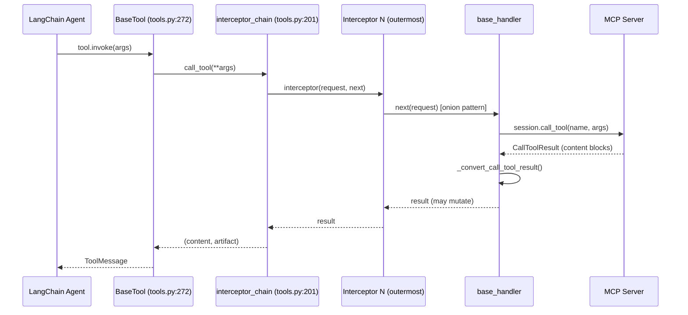
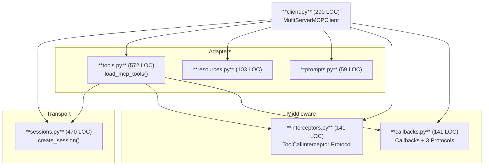

# Design Principles: langchain-mcp-adapters

> Python adapter library (~1782 LOC) bridging MCP (Model Context Protocol) servers ↔ LangChain/LangGraph.
> Synthesized from T1–T5 deep-dive study (2026-04-20).

---

## 1. Architecture Overview

**7 modules, 4 layers, 1782 LOC tổng:**

```
Entry        → client.py (290 LOC)   MultiServerMCPClient, get_tools/resources/prompt
Transport    → sessions.py (470 LOC) create_session(), 4 transport types
Adapters     → tools.py (572 LOC)    load_mcp_tools(), convert, interceptor chain
             → resources.py (103 LOC) load_mcp_resources()
             → prompts.py (59 LOC)   load_mcp_prompt()
Middleware   → interceptors.py (141 LOC) ToolCallInterceptor Protocol
             → callbacks.py (141 LOC)   Callbacks + 3 Protocol types
```

### Sequence: `get_tools()` — Multi-server parallel



### Sequence: Tool Call — Agent → MCP



### Component Dependencies



### Luồng chính

| # | Luồng | Trigger | Files | Output |
|---|-------|---------|-------|--------|
| 1 | Load tools | `get_tools()` | [`client.py:152`](../../langchain_mcp_adapters/client.py#L152), [`tools.py:436`](../../langchain_mcp_adapters/tools.py#L436), [`sessions.py:399`](../../langchain_mcp_adapters/sessions.py#L399) | `list[BaseTool]` |
| 2 | Tool call | agent invokes tool | [`tools.py:272`](../../langchain_mcp_adapters/tools.py#L272), [`tools.py:201`](../../langchain_mcp_adapters/tools.py#L201), [`interceptors.py:112`](../../langchain_mcp_adapters/interceptors.py#L112) | `ToolMessage` |
| 3 | Load resources | `get_resources()` | [`client.py:213`](../../langchain_mcp_adapters/client.py#L213), [`resources.py:60`](../../langchain_mcp_adapters/resources.py#L60) | `list[Blob]` |
| 4 | Get prompt | `get_prompt()` | [`client.py:202`](../../langchain_mcp_adapters/client.py#L202), [`prompts.py:38`](../../langchain_mcp_adapters/prompts.py#L38) | `list[HumanMessage\|AIMessage]` |
| 5 | Session mgmt | `client.session(name)` | [`client.py:114`](../../langchain_mcp_adapters/client.py#L114), [`sessions.py:399`](../../langchain_mcp_adapters/sessions.py#L399) | `AsyncContextManager[ClientSession]` |

> Nguồn chi tiết: [`lma-654-langchain-mcp-adapters-sad-diagrams.md`](../tasks/lma-654-langchain-mcp-adapters-sad-diagrams.md)

---

## 2. Core Components — Không thể thay thế

### [`tools.py`](../../langchain_mcp_adapters/tools.py) — 572 LOC, Raison d'être

Nếu xóa: library mất toàn bộ giá trị. Không có cách convert MCP tools → LangChain `BaseTool`.

Tại sao không thể thay thế:
- [`convert_mcp_tool_to_langchain_tool()`](../../langchain_mcp_adapters/tools.py#L272): Bridge MCP↔LangChain, hardcode vào đây
- [`_convert_mcp_content_to_lc_block()`](../../langchain_mcp_adapters/tools.py#L84): Xử lý 5 loại content block (TextContent, ImageContent, AudioContent, ResourceLink, EmbeddedResource) — exhaustive dispatch với `# noqa: PLR0911` (conscious decision)
- [`_list_all_tools()`](../../langchain_mcp_adapters/tools.py#L235): Chỉ tools.py biết cách paginate MCP tool list
- [`_build_interceptor_chain()`](../../langchain_mcp_adapters/tools.py#L201): Onion middleware composition engine

### [`sessions.py`](../../langchain_mcp_adapters/sessions.py) — 470 LOC, Transport Foundation

Nếu xóa: tất cả tools/resources/prompts không thể kết nối MCP server.

Tại sao không thể thay thế:
- [`create_session()`](../../langchain_mcp_adapters/sessions.py#L399): Single gateway, 4 transport branches, ENV var expansion
- 4 private implementations: [`_create_stdio_session()`](../../langchain_mcp_adapters/sessions.py#L214), [`_create_sse_session()`](../../langchain_mcp_adapters/sessions.py#L276), [`_create_streamable_http_session()`](../../langchain_mcp_adapters/sessions.py#L316), [`_create_websocket_session()`](../../langchain_mcp_adapters/sessions.py#L364)
- [`_expand_env_vars()`](../../langchain_mcp_adapters/sessions.py#L36): Config-driven `${ENV_VAR}` expansion

> **sessions.py (470) > client.py (290)**: Transport/session setup phức tạp hơn orchestration logic — điểm ngạc nhiên #1.

> Nguồn chi tiết: [`lma-dxm-langchain-mcp-adapters-strategic-eval.md`](../tasks/lma-dxm-langchain-mcp-adapters-strategic-eval.md)

---

## 3. Leverage Points — Điểm tựa

> **11.5% codebase (206/1782 LOC) → chi phối 80% behavior.** Ba leverage points dưới đây.

### LP-1: [`ToolCallInterceptor` Protocol](../../langchain_mcp_adapters/interceptors.py#L112) — 30 lines → 100% traffic

```python
# interceptors.py:111-141
@runtime_checkable
class ToolCallInterceptor(Protocol):
    async def __call__(
        self,
        request: MCPToolCallRequest,
        handler: Callable[[MCPToolCallRequest], Awaitable[MCPToolCallResult]],
    ) -> MCPToolCallResult: ...
```

**Tại sao đòn bẩy cao:** 30 lines Protocol → intercept EVERY tool call, EVERY server. Thứ tự trong list quyết định execution order — thay đổi thứ tự không cần sửa code nào.

**Extension pattern:**
```python
async def auth_interceptor(req: MCPToolCallRequest, handler) -> MCPToolCallResult:
    req = req.override(headers={"Authorization": f"Bearer {token}"})
    return await handler(req)
# Không cần import ToolCallInterceptor — duck typing
```

### LP-2: [`_build_interceptor_chain()`](../../langchain_mcp_adapters/tools.py#L201) — 32 lines → Composition Engine

```python
# tools.py:201-232 — "Code tinh hoa" #1
for interceptor in reversed(tool_interceptors):
    async def wrapped_handler(
        request: MCPToolCallRequest,
        _interceptor: ToolCallInterceptor = interceptor,  # ← default-arg capture!
        _handler: Callable = current_handler,
    ) -> MCPToolCallResult:
        return await _interceptor(request, _handler)
    current_handler = wrapped_handler
```

**Tại sao đòn bẩy cao:** `reversed()` → first interceptor = outermost. Default-arg trick giải quyết Python late-binding gotcha. Thêm 1 interceptor → cross-cutting concern cho 100% tool calls.

### LP-3: [`create_session()` dispatcher](../../langchain_mcp_adapters/sessions.py#L399) — 72 lines → Transport Gate

**Tại sao đòn bẩy cao:** Thêm transport mới → chỉ thêm `elif transport == "new":` + 1 private function. Zero sửa existing code. DRY point duy nhất cho ENV var expansion và callbacks injection.

### Scale Bottlenecks (để biết giới hạn)

| Bottleneck | Root cause | Impact 10x |
|-----------|-----------|-----------|
| No connection pool | [`tools.py:478-481`](../../langchain_mcp_adapters/tools.py#L478-L481): new session per tool call | 10× MCP handshakes |
| No tool list cache | [`tools.py:482`](../../langchain_mcp_adapters/tools.py#L482): `list_tools()` mỗi `get_tools()` | 10× discovery RPCs |
| All-or-fail gather | [`client.py:197`](../../langchain_mcp_adapters/client.py#L197): no timeout per server | Slowest server blocks all |

> Nguồn chi tiết: [`lma-cw4-langchain-mcp-adapters-code-mapping.md`](../tasks/lma-cw4-langchain-mcp-adapters-code-mapping.md) + [`lma-dxm-langchain-mcp-adapters-strategic-eval.md`](../tasks/lma-dxm-langchain-mcp-adapters-strategic-eval.md)

---

## 4. Design Principles & Rationale

### Decision A: Protocol, không phải ABC — Dependency Inversion thực sự

**Code:** [`interceptors.py:111-141`](../../langchain_mcp_adapters/interceptors.py#L111-L141), [`callbacks.py:37`](../../langchain_mcp_adapters/callbacks.py#L37)

**Tại sao Protocol (PEP 544) thay vì ABC:**
- User không cần `import ToolCallInterceptor` để implement nó. Zero coupling về import.
- ABC = force inheritance = breaking change khi library đổi import path
- `@runtime_checkable` cho phép `isinstance()` check khi cần validation
- Nguyên lý: **DIP + ISP** — depend on interface shape, not class identity; 1 method Protocol = minimal interface

**Industry refs:** `httpx.Auth` Protocol (bất kỳ callable có `auth_flow()` = auth handler), Python `Iterable` Protocol (PEP 234), FastAPI `Depends()` (structural typing cho DI), Go interfaces.

**Tradeoff:** IDE autocomplete kém hơn; sai signature phát hiện tại runtime (không compile-time, trừ mypy).

---

### Decision B: Function-based Factory Dispatch, không phải Class Hierarchy

**Code:** [`sessions.py:398-470`](../../langchain_mcp_adapters/sessions.py#L398-L470)

**Tại sao function dispatch thay vì `StdioSessionFactory(SessionFactory)`:**
- Connections đến từ external config (YAML/JSON/env vars) → string-based dispatch = config-driven architecture
- `connection["transport"]` là string → JSON-serializable, không cần instantiate factory object
- Thêm transport alias ([`commit 7d06f49`](https://github.com/langchain-ai/langchain-mcp-adapters/commit/7d06f49)): chỉ thêm `elif transport in {"streamable_http", "http"}:` — 1 dòng
- Nguyên lý: **Factory Method (GoF) + OCP + SRP** — không class hierarchy at call site

**Industry refs:** SQLAlchemy `create_engine("postgresql://...")`, Django `DATABASES["ENGINE"]`, LangChain `init_chat_model("gpt-4")` — cùng philosophy string-dispatch trong LangChain ecosystem.

---

### Decision C: Tombstone Pattern — Context Manager Removal (v0.1.0)

**Code:** [`client.py:33-42`](../../langchain_mcp_adapters/client.py#L33-L42) (error message), [`client.py:255-279`](../../langchain_mcp_adapters/client.py#L255-L279) (tombstone methods)

**Tại sao xóa `async with MultiServerMCPClient(...):`:**
- `async with obj:` implies "obj IS a single atomic resource" — `MultiServerMCPClient` quản lý N servers với N independent lifecycles, không phải 1 resource
- Thay bằng: `async with client.session("server_name") as session:` — explicit, per-server resource
- **Tombstone**: `__aenter__` vẫn tồn tại nhưng raise `NotImplementedError(ASYNC_CONTEXT_MANAGER_ERROR)` với migration guide. Nếu simply delete: user nhận `TypeError` vô nghĩa. `NotImplementedError` với message rõ = better DX.

**Industry refs:** `asyncpg.Pool.acquire()` (Pool ≠ connection), `concurrent.futures.ProcessPoolExecutor` (orchestrator ≠ resource).

---

### Decision D: Default-arg Closure Capture — Python Late-binding Fix

**Code:** [`tools.py:201-232`](../../langchain_mcp_adapters/tools.py#L201-L232)

```python
async def wrapped_handler(
    request: MCPToolCallRequest,
    _interceptor: ToolCallInterceptor = interceptor,  # by-value capture!
    _handler: Callable = current_handler,
) -> MCPToolCallResult:
```

**Tại sao default args thay vì closure capture:** Python closure capture = by-reference (late binding). Nếu không dùng default args, tất cả closures capture cùng tham chiếu (giá trị cuối của loop). Default args = by-value (early binding). Classic Python gotcha được giải quyết đúng cách.

**Industry refs:** Django middleware chain, Starlette middleware — cùng pattern. [Python docs "lambda in a loop" problem].

> Nguồn chi tiết: [`lma-o7d-langchain-mcp-adapters-deep-research.md`](../tasks/lma-o7d-langchain-mcp-adapters-deep-research.md)

---

## 5. Mental Shortcuts & Exercises

### 5 Shortcuts để hiểu nhanh (11.5% code → 80% understanding)

| # | Shortcut | Anchor | Pitfall |
|---|---------|--------|---------|
| 1 | **Đọc `create_session()` trước, không phải README** | [`sessions.py:399`](../../langchain_mcp_adapters/sessions.py#L399) | README nói "MCP client" nhưng phức tạp nằm trong transport dispatch |
| 2 | **Interceptors mutate, Callbacks observe** | [`interceptors.py:112`](../../langchain_mcp_adapters/interceptors.py#L112) vs [`callbacks.py:37`](../../langchain_mcp_adapters/callbacks.py#L37) | Nhầm callbacks với interceptors → không modify request được |
| 3 | **Default-arg trong vòng lặp = early binding** | [`tools.py:201`](../../langchain_mcp_adapters/tools.py#L201) | Bỏ default-arg → tất cả wrapped_handlers dùng cùng interceptor |
| 4 | **Tool result là `(content, artifact)` tuple, không phải string** | [`tools.py:70`](../../langchain_mcp_adapters/tools.py#L70) | Expect string → ToolMessage sai format |
| 5 | **Tombstone error = migration guide** | [`client.py:33`](../../langchain_mcp_adapters/client.py#L33) | `async with client:` → đọc error message là đủ để migrate |

### 3 Bài tập thực hành (có verify criteria)

**Bài 1: Logging Interceptor (~30 phút)**

Viết interceptor log mọi tool call:
```python
async def logging_interceptor(request: MCPToolCallRequest, handler) -> MCPToolCallResult:
    print(f"[TOOL] {request.name}({request.args})")
    result = await handler(request)
    print(f"[RESULT] {result}")
    return result
# Không import ToolCallInterceptor — duck typing
```
**Verify:** `isinstance(logging_interceptor, ToolCallInterceptor)` → `True` (nhờ `@runtime_checkable`)

**Bài 2: MockTransport trong `create_session()` (~60 phút)**

Thêm transport `"mock"` mà không sửa existing code:
```python
elif connection["transport"] == "mock":
    result = await _create_mock_session(connection)
    ...
# Xem sessions.py:438-470 để copy đúng pattern
```
**Verify:** `await create_session({"transport": "mock", ...})` không raise `ValueError`.

**Bài 3: Content Audit — Exhaustive Dispatch (~45 phút)**

Thêm content type mới vào [`tools.py:84`](../../langchain_mcp_adapters/tools.py#L84):
```python
elif isinstance(content, VideoContent):  # giả sử MCP thêm VideoContent
    return {"type": "video", "url": content.uri}
```
**Verify:** Assertion cho mỗi content type — không có unhandled case.

> Nguồn chi tiết: [`lma-1vw-langchain-mcp-adapters-skill-transfer.md`](../tasks/lma-1vw-langchain-mcp-adapters-skill-transfer.md)

---

## Appendix: "Code Tinh Hoa" — 4 đoạn code đáng học nhất

| # | File | Lines | Tại sao đáng học |
|---|------|-------|-----------------|
| 1 | [`tools.py:201-232`](../../langchain_mcp_adapters/tools.py#L201-L232) | 32 | Onion pattern + closure early-binding trick [WINNER] |
| 2 | [`interceptors.py:111-141`](../../langchain_mcp_adapters/interceptors.py#L111-L141) | 30 | Protocol + `@runtime_checkable` + `MCPToolCallRequest.override()` |
| 3 | [`callbacks.py:104-141`](../../langchain_mcp_adapters/callbacks.py#L104-L141) | 37 | Walrus operator + closure adapter pattern |
| 4 | [`tools.py:84-132`](../../langchain_mcp_adapters/tools.py#L84-L132) | 48 | Exhaustive isinstance dispatch + `# noqa: PLR0911` conscious decision |
