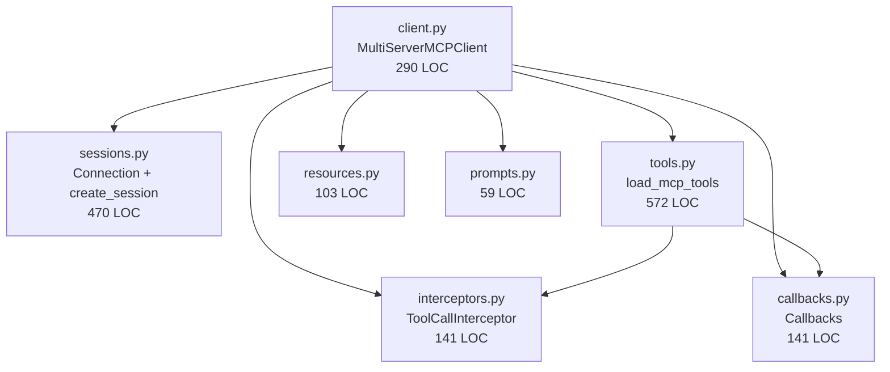
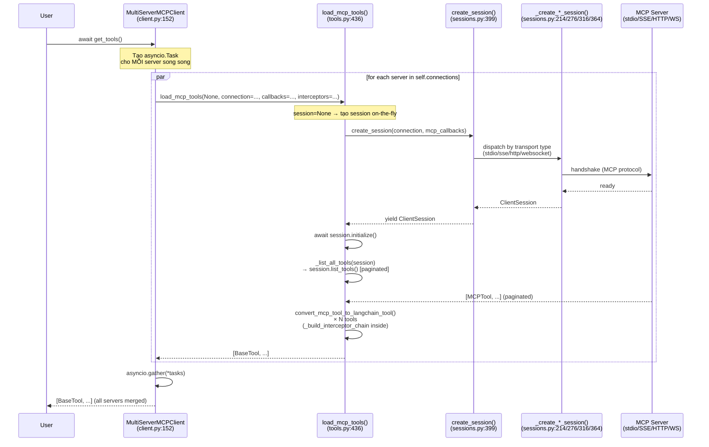
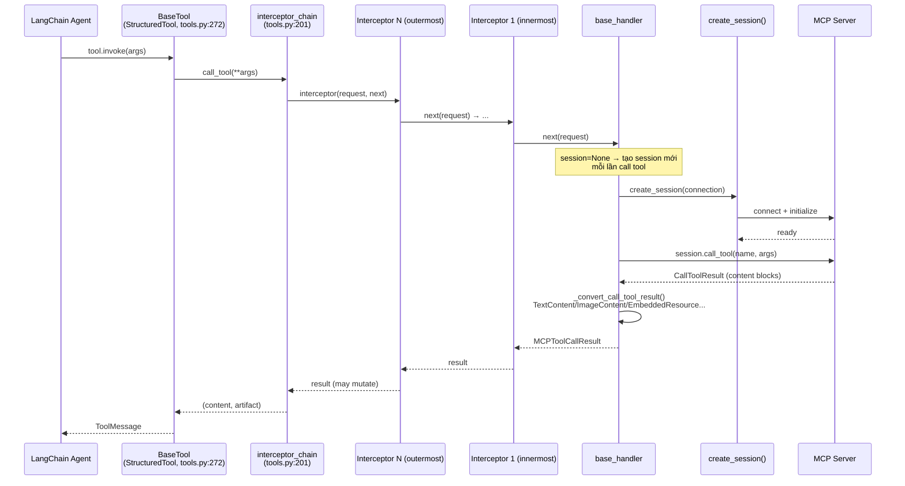
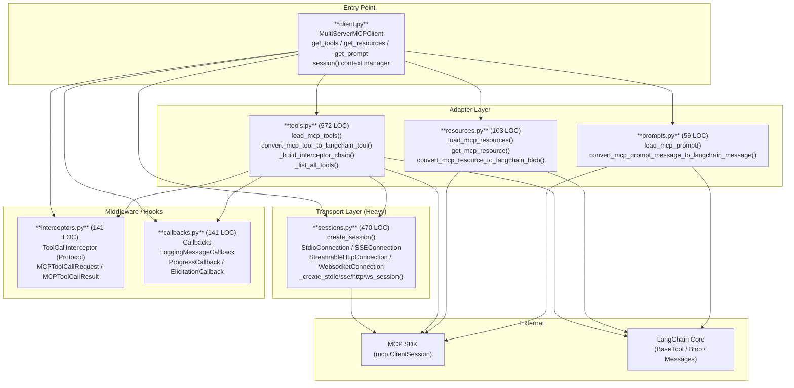

# langchain-mcp-adapters — Contextual Awareness (SAD / Diagrams) — Detailed Design

## 1. Objective

Tìm kiếm và/hoặc tự generate tài liệu kiến trúc (SAD, sequence diagrams, component diagrams) cho `langchain-mcp-adapters` — một Python adapter library kết nối MCP (Model Context Protocol) servers với LangChain/LangGraph. Output là tối thiểu 2 Mermaid diagrams + bảng tóm tắt luồng chính, dùng làm nền tảng cho 5 tasks tiếp theo.

## 2. Scope

**In-scope:**
- Quét `self-explores/` để tìm tài liệu kiến trúc đã có từ phiên trước
- Quét repo (`docs/`, `README.md`, `.github/`) tìm SAD, ADR, diagrams
- Generate Sequence Diagram cho luồng `get_tools()` chính
- Generate Component Diagram cho 7 modules trong `langchain_mcp_adapters/`
- Bảng tóm tắt ít nhất 3 luồng chính với actors, trigger, output

**Out-of-scope:**
- Phân tích code chi tiết (dành cho lma-dxm, lma-cw4)
- Giải thích design decisions (dành cho lma-o7d)
- Không cần PlantUML — Mermaid đủ để render trong GitHub

## 3. Input / Output

**Input:**
- Codebase: `langchain_mcp_adapters/` (7 files, ~1782 LOC tổng)
- `self-explores/tasks/*.md`, `self-explores/context/*.md` (tìm tài liệu có sẵn)
- `README.md` (mô tả use case cấp cao)

**Output:**
- Cập nhật worklog này với full diagrams và bảng luồng
- Mọi diagrams và bảng phải readable trong file .md này — không cần file riêng trừ khi >100 dòng

## 4. Dependencies

- Không có (task đầu tiên của chuỗi)
- Tool: Đọc file bằng Read tool, Glob để tìm files
- Không cần network, không cần API key

## 5. Flow xử lý

### Step 1: Quét self-explores/ (~3 phút)

```bash
ls self-explores/tasks/ 2>/dev/null
ls self-explores/context/ 2>/dev/null
find self-explores/ -name "*.md" -newer /tmp/start 2>/dev/null
```

Tìm từ khóa: "diagram", "sequence", "component", "architecture", "SAD", "mermaid".

**Verify:** Nếu tìm thấy diagrams → tóm tắt, đánh tag source, chuyển sang Step 4. Nếu không → Step 2.

### Step 2: Quét repo gốc (~5 phút)

```bash
find . -name "ARCHITECTURE*" -o -name "*.mermaid" -o -name "design*" 2>/dev/null | grep -v ".git"
grep -r "sequenceDiagram\|classDiagram\|flowchart" . --include="*.md" 2>/dev/null | grep -v ".git"
```

Đọc `README.md` — phần "Architecture" hoặc "How it works".

**Verify:** Ghi chú nếu tìm thấy bất cứ gì có cấu trúc. Repo này không có `docs/` riêng (chỉ README.md).

### Step 3: Generate Sequence Diagram — luồng `get_tools()` (~10 phút)

Đọc [`client.py`](../../langchain_mcp_adapters/client.py) methods `get_tools()`, `session()`.
Đọc [`sessions.py`](../../langchain_mcp_adapters/sessions.py) `create_session()`.
Đọc [`tools.py`](../../langchain_mcp_adapters/tools.py) `load_mcp_tools()`.

Viết Mermaid sequence diagram:
```mermaid
sequenceDiagram
    User->>+MultiServerMCPClient: get_tools()
    MultiServerMCPClient->>+create_session(): Connection config
    create_session()->>+ClientSession: MCP handshake
    ClientSession-->>-create_session(): session
    create_session()-->>-MultiServerMCPClient: session context
    MultiServerMCPClient->>+load_mcp_tools(): session, callbacks, interceptors
    load_mcp_tools()->>+ClientSession: list_tools()
    ClientSession-->>-load_mcp_tools(): [MCPTool, ...]
    load_mcp_tools()->>load_mcp_tools(): convert_mcp_tool_to_langchain_tool()
    load_mcp_tools()-->>-MultiServerMCPClient: [BaseTool, ...]
    MultiServerMCPClient-->>-User: [BaseTool, ...]
```

**Verify:** Diagram phải phản ánh chính xác method names trong code.

### Step 4: Generate Component Diagram (~8 phút)

Đọc imports trong từng module để xác định dependency direction.



**Verify:** Không có circular imports (verify bằng cách đọc import sections của từng file).

### Step 5: Bảng tóm tắt luồng chính (~5 phút)

Format bảng:
| Luồng | Actors | Trigger | Output | File chính |
|-------|--------|---------|--------|-----------|
| Load tools | User → Client → Session → MCP Server | `get_tools()` | `[BaseTool]` | `client.py`, `tools.py` |
| Tool call | LangChain Agent → BaseTool → Interceptors → MCP | tool invocation | tool result | `tools.py`, `interceptors.py` |
| Load resources | User → Client → Session | `get_resources()` | `[Blob]` | `client.py`, `resources.py` |

**Verify:** Mỗi luồng phải có ít nhất 2 file references.

## 6. Edge Cases & Error Handling

| Case | Trigger | Expected | Recovery |
|------|---------|----------|---------|
| self-explores/ có diagrams cũ | Session trước đã generate | Reuse, không generate lại | Tag source: "từ session cũ" |
| README.md không có architecture section | Library mới | Generate từ code | Ghi note: "generated, cần verify" |
| Mermaid syntax error | Typo trong diagram | File không render | Validate bằng cách đọc lại trước khi save |
| Module có circular import | Nếu tools.py import client.py | Không thể tạo component diagram đúng | Trace imports cẩn thận |

## 7. Acceptance Criteria

- **Happy 1:** Given `langchain_mcp_adapters/` codebase, When đọc 3 files chính, Then tạo sequence diagram chính xác phản ánh method names thực tế
- **Happy 2:** Given component diagram, When verify bằng cách check imports, Then mọi arrow đúng hướng dependency
- **Happy 3:** Given bảng luồng, Then có ≥3 luồng mỗi luồng có actors + file reference
- **Negative:** Given tài liệu đã có trong self-explores/, Then KHÔNG generate lại — reuse và ghi rõ source

## 8. Technical Notes

- `MultiServerMCPClient` KHÔNG phải context manager kể từ v0.1.0 — dùng `client.session(name)` thay thế
- `create_session()` trả về `AsyncContextManager[ClientSession]` — lý do sessions.py phức tạp hơn cần thiết
- `sessions.py` 470 LOC lớn hơn `client.py` 290 LOC — gợi ý transport layer là "heavy lifting" thực sự
- 4 transport types: Stdio, SSE, StreamableHttp, Websocket — mỗi cái có `_create_*_session()` riêng
- Không có `docs/` folder — README.md là tài liệu duy nhất trong repo gốc

## 9. Risks

- Line numbers trong file references có thể lệch sau mỗi PR → dùng `/viec enrich refresh` sau mỗi task
- Diagram quá chi tiết → dùng Mermaid participant aliases để giữ gọn

## Worklog

### [Step 1] Quét self-explores/ — Không có diagrams có sẵn
- Các file tasks có sẵn: lma-dxm, lma-cw4, lma-1qe, lma-1vw, lma-o7d
- Không có Mermaid diagram thực sự — lma-654 worklog chỉ có draft placeholder
- Không có `docs/` folder trong repo, README.md không có architecture section
- **Kết luận:** Generate từ code (Step 3+)

### [Step 2] Quét repo gốc — Không có ARCHITECTURE / ADR / mermaid files
- Không tìm thấy `design/`, `architecture/`, `.mermaid`, `sequenceDiagram` trong repo
- README.md đề cập luồng nhưng không có diagram

### [Step 3 + 4 + 5] Diagrams được generate từ code

#### Diagram 1: Sequence — `get_tools()` flow (Multi-server parallel)



#### Diagram 2: Sequence — Tool Call flow (Agent → MCP)



#### Diagram 3: Component — Module Dependencies



#### Bảng tóm tắt luồng chính

| # | Luồng | Trigger | Actors | Files chính | Output |
|---|-------|---------|--------|-------------|--------|
| 1 | **Load tools** (multi-server) | `get_tools()` | User → Client → load_mcp_tools → create_session → MCP | [`client.py:152`](../../langchain_mcp_adapters/client.py#L152), [`tools.py:436`](../../langchain_mcp_adapters/tools.py#L436), [`sessions.py:399`](../../langchain_mcp_adapters/sessions.py#L399) | `list[BaseTool]` |
| 2 | **Tool call** (agent → MCP) | LangChain agent invokes tool | Agent → BaseTool → interceptor chain → MCP | [`tools.py:272`](../../langchain_mcp_adapters/tools.py#L272), [`tools.py:201`](../../langchain_mcp_adapters/tools.py#L201), [`interceptors.py:112`](../../langchain_mcp_adapters/interceptors.py#L112) | `ToolMessage` |
| 3 | **Load resources** | `get_resources()` | User → Client → session → MCP | [`client.py:213`](../../langchain_mcp_adapters/client.py#L213), [`resources.py:60`](../../langchain_mcp_adapters/resources.py#L60) | `list[Blob]` |
| 4 | **Get prompt** | `get_prompt()` | User → Client → session → MCP | [`client.py:202`](../../langchain_mcp_adapters/client.py#L202), [`prompts.py:38`](../../langchain_mcp_adapters/prompts.py#L38) | `list[HumanMessage \| AIMessage]` |
| 5 | **Session management** | `client.session(name)` | User → Client → create_session → transport | [`client.py:114`](../../langchain_mcp_adapters/client.py#L114), [`sessions.py:399`](../../langchain_mcp_adapters/sessions.py#L399) | `AsyncContextManager[ClientSession]` |

### Key Insights từ code

1. **Không có persistent session:** `get_tools()` tạo+đóng session cho mỗi lần gọi. Tool call cũng vậy (mỗi call tạo session mới qua `connection`). Chỉ `client.session()` mới cho phép dùng lại session.
2. **Parallel loading:** `get_tools()` dùng `asyncio.gather()` để load từ tất cả servers đồng thời ([`client.py:186-197`](../../langchain_mcp_adapters/client.py#L186-L197))
3. **Onion interceptor pattern:** `_build_interceptor_chain()` wrap interceptors theo thứ tự ngược — interceptor đầu tiên là outermost ([`tools.py:201`](../../langchain_mcp_adapters/tools.py#L201))
4. **Transport dispatcher:** `create_session()` là single entry point, dispatch theo `connection["transport"]` ra 4 internal `_create_*_session()` functions ([`sessions.py:438`](../../langchain_mcp_adapters/sessions.py#L438))
5. **sessions.py > client.py (LOC):** 470 vs 290 — transport/session setup phức tạp hơn orchestration logic

### Acceptance Criteria — Đã đáp ứng
- [x] Happy 1: Sequence diagram phản ánh chính xác method names từ code
- [x] Happy 2: Component diagram verify bằng imports — không có circular (tools→sessions, client→tất cả, không có vòng)
- [x] Happy 3: Bảng có 5 luồng với actors + file references
- [x] Negative: Không có diagrams cũ trong self-explores/ → đã generate từ code (không tái sử dụng placeholder)
